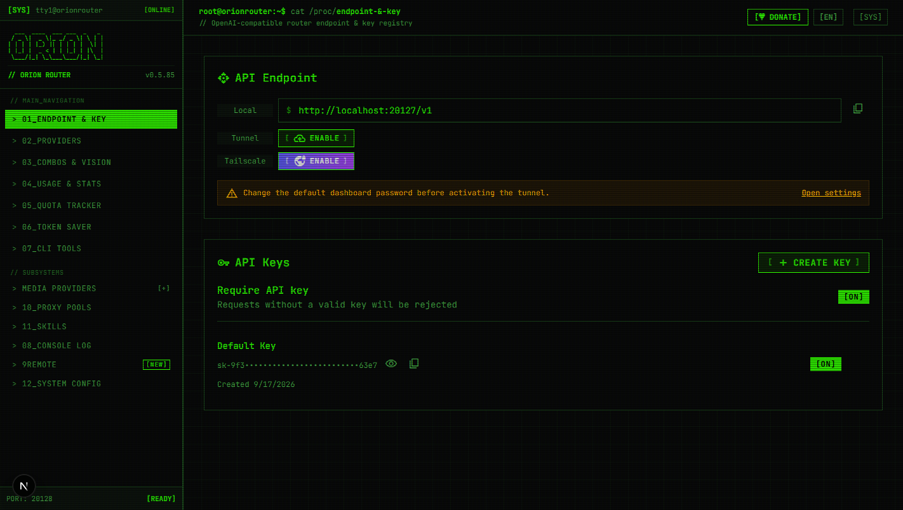
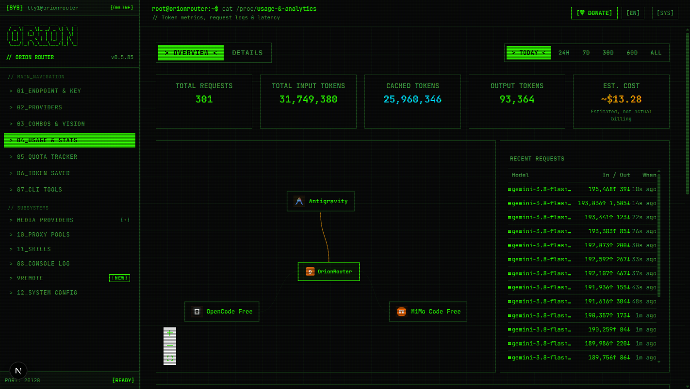
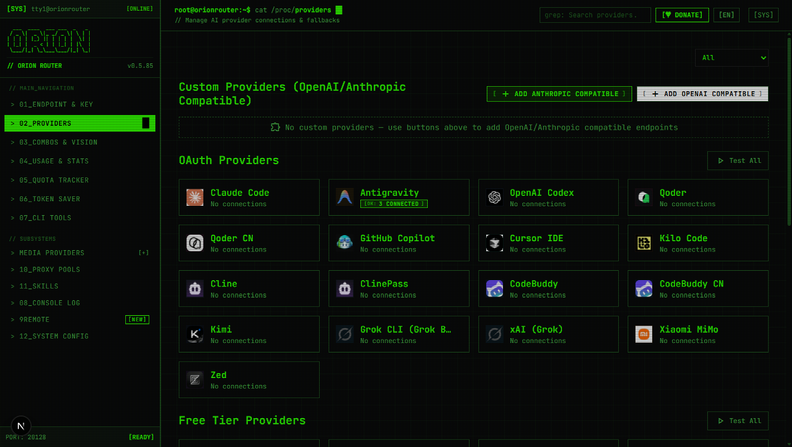
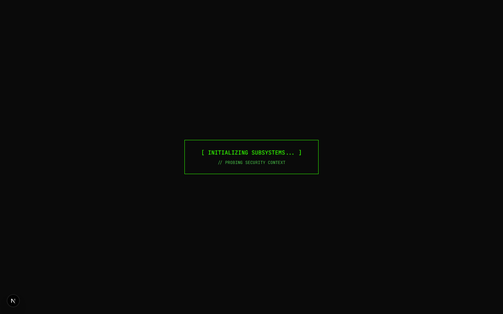

<div align="center">
  

  # OrionRouter
  ### Terminal AI Gateway & Token Optimization Engine

  **Save 20–40% tokens with intelligent compression, multi-provider fallback, and unified API routing for AI coding agents.**

  Connect any AI coding tool (**Claude Code**, **Cursor**, **Codex**, **Copilot**, **Cline**, **OpenClaw**, **Zed**, and more) to 40+ AI providers through a single OpenAI-compatible gateway.

  [Screenshots](#-screenshots) • [Features](#-key-features) • [Architecture](#-how-it-works) • [Quick Start](#-quick-start) • [Configuration](#-configuration) • [Supported Providers](#-supported-providers) • [API Reference](#-api-reference)

  <br/>
  

</div>

---

## 📸 Screenshots

<div align="center">

### Terminal Dashboard (Overview)


### Usage & Token Analytics


### Providers & Fallback Nodes


### Access Control & Login Workstation


</div>

---

## Overview

**OrionRouter** is a self-hosted AI routing engine and proxy designed for developers running coding agents 24/7. It sits between your developer tools and upstream model providers to optimize token usage, eliminate downtime, and route requests intelligently.

- **Token Compression (RTK)**: Automatically detects and losslessly compresses large command and tool outputs (`git diff`, `grep`, `find`, `ls`, file dumps) before sending them to the LLM, reducing input token consumption by 20–40%.
- **Automatic Multi-Tier Fallback**: Chain providers into custom fallback combos (e.g., *Primary Subscription → Cheap Backup → Free Tier*) so your agents never halt mid-task.
- **Protocol & Format Translation**: Seamlessly translates requests across OpenAI, Anthropic Claude, Google Gemini, and custom formats.
- **Quota & Token Tracking**: Real-time monitoring of token consumption, rate limits, and estimated costs with reset countdowns.
- **Terminal CLI Design System**: Built with a high-contrast cyber-industrial terminal aesthetic for fast, clean monitoring.

---

## Architecture

```
┌─────────────────────────────────────────────────────────────┐
│                       Developer Tools                       │
│  (Claude Code, Cursor, Codex, Cline, OpenClaw, Continue...) │
└──────────────────────────────┬──────────────────────────────┘
                               │ http://localhost:20128/v1
                               ▼
┌─────────────────────────────────────────────────────────────┐
│                         OrionRouter                         │
│  • RTK Token Compression (lossless tool_result optimization)│
│  • Format & Protocol Translation (OpenAI ↔ Claude ↔ Gemini) │
│  • Quota Tracking & Auto Token Refresh                      │
│  • Intelligent Multi-Account Round-Robin                    │
└──────────────────────────────┬──────────────────────────────┘
                               │
       ┌───────────────────────┼───────────────────────┐
       ▼                       ▼                       ▼
┌──────────────┐       ┌──────────────┐       ┌──────────────┐
│    Tier 1    │       │    Tier 2    │       │    Tier 3    │
│ Subscription │ ──►   │ Cheap Backup │ ──►   │  Free Models │
│ (Claude,     │       │ (GLM, MiniMax│       │  (Kiro,      │
│  Codex,      │       │  DeepSeek)   │       │   OpenCode)  │
│  Copilot)    │       │              │       │              │
└──────────────┘       └──────────────┘       └──────────────┘
```

---

## Key Features

| Feature | Description | Impact |
|---|---|---|
| **RTK Token Saver** | Lossless compression pipeline for shell & tool outputs (`git diff`, `grep`, `ls`, etc.) | **Saves 20–40% input tokens** per prompt |
| **Caveman Mode** | Optional prompt injection for ultra-terse, high-density model responses | **Up to 65% fewer output tokens** |
| **Ponytail Engine** | Prompts coding models to prioritize YAGNI, minimal diffs, and stdlib implementations | **Leaner code output, fewer roundtrips** |
| **Smart Fallbacks** | Multi-tier model chaining with automatic failover on rate limits or errors | **Zero downtime during development** |
| **Format Translation** | Bi-directional translation between OpenAI, Claude, Gemini, and vendor formats | **Use any model with any IDE/CLI client** |
| **Multi-Account Routing** | Add multiple credentials per provider with round-robin load balancing | **Distribute workload across quotas** |
| **Live Quota Tracking** | Real-time usage tracking, quota countdown timers, and request history | **Full visibility into model consumption** |
| **Local-First & Private** | Self-hosted on your machine with SQLite storage. Credentials stay local | **Complete privacy and control** |

---

## Quick Start

### Prerequisites

- **Node.js** >= 20.x
- **npm** or **bun**

### 1. Clone & Install

```bash
git clone https://github.com/rookiecoder910/Orion-router.git
cd Orion-router
npm install
```

### 2. Configure Environment

Copy the example environment file:

```bash
cp .env.example .env
```

Set your preferred port and secrets in `.env`:

```env
PORT=20128
JWT_SECRET=your-random-jwt-secret
INITIAL_PASSWORD=your-secure-password
```

### 3. Run Development Server

```bash
npm run dev
```

Open [http://localhost:20128](http://localhost:20128) to access the OrionRouter dashboard.

### 4. Build for Production

```bash
npm run build
npm run start
```

---

## Connecting Your Tools

Point any OpenAI-compatible client to OrionRouter:

- **Base URL**: `http://localhost:20128/v1`
- **API Key**: Any key configured in your OrionRouter dashboard (or Bearer token)

### Cursor IDE

In **Settings → Models → OpenAI API Key / Base URL**:
```text
Base URL: http://localhost:20128/v1
API Key:  <your-dashboard-key>
Model:    <selected-model-or-combo>
```

### Claude Code

Edit `~/.claude/config.json`:
```json
{
  "anthropic_api_base": "http://localhost:20128/v1",
  "anthropic_api_key": "your-orion-key"
}
```

### Cline / Roo Code / Continue

```text
API Provider: OpenAI Compatible
Base URL:     http://localhost:20128/v1
API Key:      your-orion-key
Model:        <model-id-or-combo-name>
```

---

## Supported Providers

OrionRouter supports 40+ providers across multiple authentication methods:

- **OAuth Providers**: Claude Code, Codex, GitHub Copilot, Cursor, Antigravity, Kimchi
- **Free / Community Tiers**: Kiro AI, OpenCode Free, Google Vertex AI credits
- **API Key Providers**: OpenAI, Anthropic, Google Gemini, DeepSeek, GLM (Zhipu), MiniMax, Moonshot Kimi, Groq, xAI, Mistral, Together AI, Fireworks, Cerebras, Cohere, NVIDIA NIM, SiliconFlow
- **Self-Hosted Local Services**: Whisper.cpp (STT), Kokoro-FastAPI (TTS), llama.cpp / vLLM / Infinity (Embeddings & Completions)

---

## Configuration

Key environment variables available in `.env`:

| Variable | Default | Description |
|---|---|---|
| `PORT` | `20128` | Local HTTP service port |
| `NODE_ENV` | `development` | Runtime environment (`development` / `production`) |
| `JWT_SECRET` | auto-generated | Secret key for dashboard authentication sessions |
| `INITIAL_PASSWORD` | `123456` | Initial dashboard password |
| `DATA_DIR` | system app data | Directory for SQLite database (`data.sqlite`) and logs |
| `ENABLE_REQUEST_LOGS`| `false` | Enable full payload debugging logs under `logs/` |
| `REQUIRE_API_KEY` | `false` | Require valid Bearer token for all `/v1/*` requests |
| `HTTP_PROXY` / `HTTPS_PROXY` | - | Optional outbound proxy for upstream provider requests |

---

## API Reference

OrionRouter exposes standard OpenAI-compatible endpoints:

### Chat Completions

```bash
curl http://localhost:20128/v1/chat/completions \
  -H "Content-Type: application/json" \
  -H "Authorization: Bearer your-api-key" \
  -d '{
    "model": "glm/glm-4.7",
    "messages": [
      {"role": "user", "content": "Explain binary search in one sentence."}
    ],
    "stream": true
  }'
```

### List Models & Combos

```bash
curl http://localhost:20128/v1/models \
  -H "Authorization: Bearer your-api-key"
```

---

## Tech Stack

- **Runtime**: Node.js 20+ / Bun
- **Application Framework**: Next.js 16
- **Frontend & UI**: React 19, Tailwind CSS 4, Monaco Editor
- **Storage**: SQLite via `better-sqlite3`
- **Streaming**: Server-Sent Events (SSE)
- **Token Compression**: RTK AST & regex-based pipeline

---

## License

This project is licensed under the [MIT License](LICENSE).
